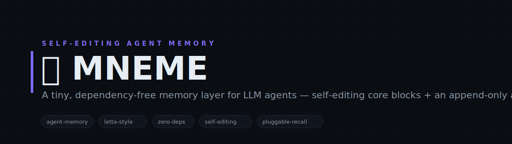
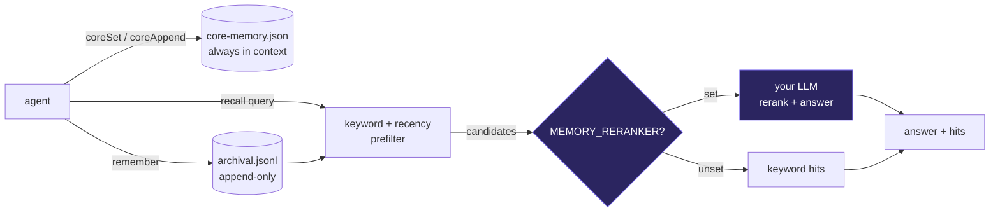

<!-- Memory — white-label. No personal or company identifiers in this file by design. -->

<p align="center">
  
</p>

<h1 align="center">🧠 Memory</h1>

<p align="center">
  <b>A tiny, dependency-free memory layer for LLM agents — self-editing core blocks + an append-only archive, with pluggable smart recall.</b><br>
  <sub>Give your agent a memory that survives every session without a vector database, an embedder, or a server. Memory keeps two things on disk: self-editing core blocks that are always in context (persona, the human, working notes), and an append-only archival log you can recall from. Recall runs a fast keyword/recency prefilter and — if you plug one in — hands the candidates to any LLM to rerank and answer. No reranker? It degrades to keyword recall and never throws. Node and Python twins share the exact same files.</sub>
</p>

<p align="center">

= 18">

</p>

<p align="center">
<code>agent-memory</code> · <code>letta-style</code> · <code>zero-deps</code> · <code>self-editing</code> · <code>pluggable-recall</code> · <code>node-python</code>
</p>

---

## Why Memory

Most agents forget everything the moment the context window rolls. Memory fixes that with the smallest thing that works: plain files. Core blocks stay in context and edit themselves as the agent learns; the archive is an append-only JSONL you can grep, back up, or diff. Recall is a keyword/recency prefilter that's useful on its own and gets smart the instant you point MEMORY_RERANKER at an LLM — it reranks the candidates and answers the query. No embeddings to compute, no database to run, no lock-in. Bring your own model, or use none.

---

## What it does

| Module | What it does | Signal |
|---|---|---|
| **core blocks** | Self-editing always-in-context memory (persona / human / notes), atomic writes | always in context |
| **archival log** | Append-only JSONL long-term store with keyword/recency recall | grep-able, $0 |
| **pluggable recall** | Optional MEMORY_RERANKER hands candidates to any LLM to rerank + answer | bring your own model |

---

## Architecture



---

## Quickstart

```bash
# 1. no install needed — pure Node builtins (Python twin is stdlib-only)
node lib/memory.cjs health

# 2. write some memory, then recall it
node lib/memory.cjs remember "the launch shipped on the 14th, all green"
node lib/memory.cjs remember "the retro is next Tuesday"
node lib/memory.cjs recall "when did we launch"

# 3. edit the always-in-context core blocks
node lib/memory.cjs core-set human "Ada — founder, ships fast"
node lib/memory.cjs prompt          # renders the blocks for your system prompt

# 4. (optional) smart recall — point at any LLM adapter
MEMORY_RERANKER=./examples/reranker-echo.cjs node lib/memory.cjs recall "when did we launch"
```

> State persists to ./data (core-memory.json + append-only archival.jsonl), created on first write and gitignored. The Node and Python twins share those exact files, so you can write from one and read from the other. Everything is $0 and dependency-free; recall never throws.

---

## Repository layout

```
memory/
├── lib/
│   └── memory.cjs             ← the memory layer (coreSet / remember / recall)  [Node]
├── python/
│   └── memory.py             ← the stdlib-only twin, shares the same ./data files  [Python]
├── examples/
│   ├── demo.cjs             ← write a few memories, watch recall rank them
│   └── reranker-echo.cjs    ← a zero-dep example MEMORY_RERANKER (swap for a real LLM)
└── data/                    ← core-memory.json + archival.jsonl (gitignored, auto-created)
```

---

## Design principles

1. **The smallest thing that works.** Plain files — no vector DB, no embedder, no server. Robust, offline, $0, and trivial to back up or inspect.
2. **Smart is optional, never required.** Recall is useful as keyword/recency out of the box, and gets an LLM rerank the instant you plug one in. No model, no problem.
3. **One source of truth.** The Node and Python twins read and write the same ./data files, byte-for-byte — write from either, recall from either.
4. **Never throws.** Atomic writes, fail-open reads — safe to call inline in any agent loop.

---

<p align="center"><sub>Memory · remember · recall · never forget · MIT</sub></p>
