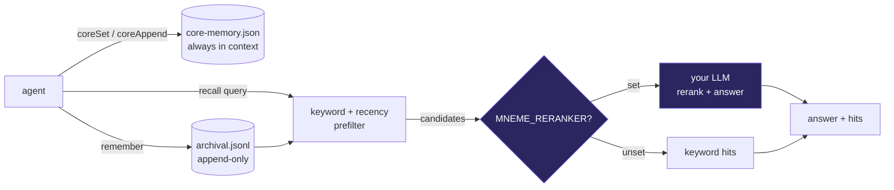

# MNEME — Architecture

Give your agent a memory that survives every session without a vector database, an embedder, or a server. MNEME keeps two things on disk: self-editing core blocks that are always in context (persona, the human, working notes), and an append-only archival log you can recall from. Recall runs a fast keyword/recency prefilter and — if you plug one in — hands the candidates to any LLM to rerank and answer. No reranker? It degrades to keyword recall and never throws. Node and Python twins share the exact same files.

## Flow

## How it fits together

MNEME is two twin files over a shared on-disk store. `lib/mneme.cjs` (Node) and `python/mneme.py` (stdlib-only Python) both read and write `./data/core-memory.json` (self-editing always-in-context blocks) and `./data/archival.jsonl` (append-only long-term log). Core memory is a tiny key→text map rendered into your system prompt via `memoryPrompt()`; `coreSet`/`coreAppend` persist atomically (write-tmp-then-rename, safe on synced drives). Archival `remember(text, meta)` appends one JSON line. `recall(query, {k})` tokenizes the query (stop-worded), scores every archival row by keyword overlap plus a small recency bonus, and takes the top candidates — that alone is useful. If `MNEME_RERANKER` points at a module exporting `async rerank(query, candidates, k) → {answer, order}`, recall hands it the candidates and returns its answer plus the reranked hits; if the reranker is unset, missing, or throws, recall returns the keyword hits and marks `via:'keyword'`. Every filesystem path is guarded and fail-open, so recall never throws — safe to call inline in a hot agent loop.

## Extending it

Every capability is a self-contained module. To add your own, follow the contract the existing
modules use and wire it into the entry point. Keep it portable — config via `.env`, no hardcoded
paths, no personal accounts.

## Design principles

1. **The smallest thing that works.** Plain files — no vector DB, no embedder, no server. Robust, offline, $0, and trivial to back up or inspect.
2. **Smart is optional, never required.** Recall is useful as keyword/recency out of the box, and gets an LLM rerank the instant you plug one in. No model, no problem.
3. **One source of truth.** The Node and Python twins read and write the same ./data files, byte-for-byte — write from either, recall from either.
4. **Never throws.** Atomic writes, fail-open reads — safe to call inline in any agent loop.
